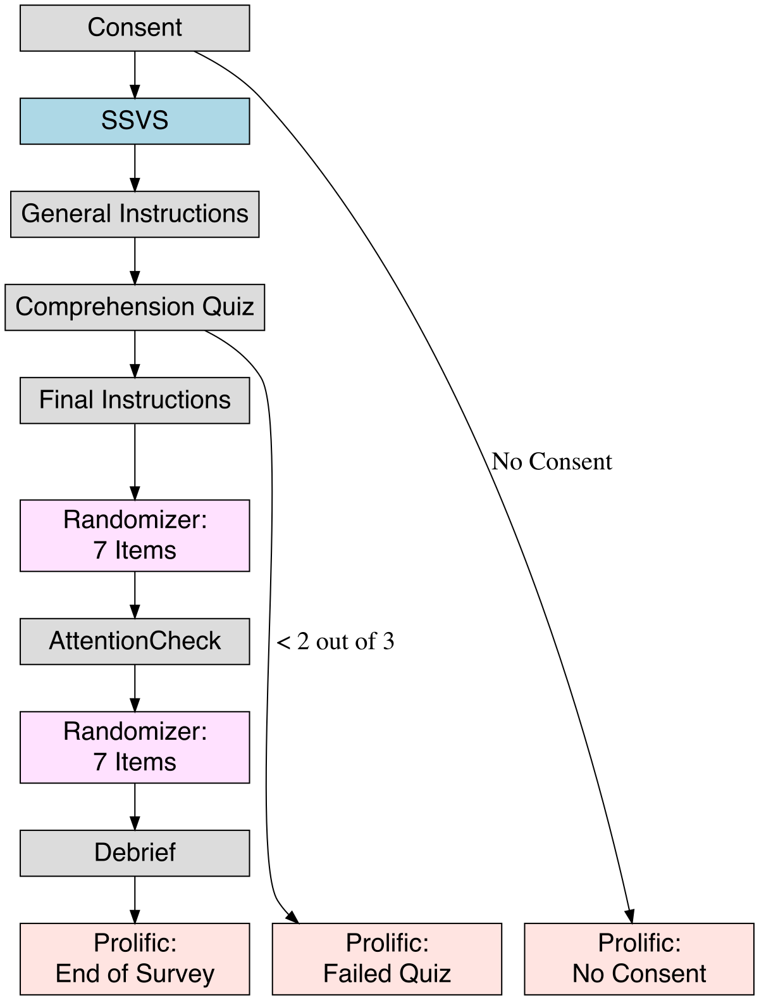

### Procedure

For complete survey materials, see see Appendix B: Survey. 

#### Adapted Short Schwartz Value Survey

The primary instrument in all surveys is the 10-item Short Schwartz Value Survey (SSVS) questionnaire developed by [@lindeman2005measuring], which participants completed on the Qualtrics[^12_survey-2] survey platform. Each of the 10 questionnaire items in the SSVS is the name of a specific value in the Schwartz value inventory, along with a few descriptive words e.g. "POWER (social power, authority, wealth, influence on people and events)". We asked participants to read the instructions from the Schwartz Value Survey[^12_survey-1] in order to introduce the concept of personal values, and to instruct them on how to complete the questionnaire [@schwartz2005schwartz]. The response format is a 9-point Likert scale which ranges from -1 (Opposed to their values) and 0 (Not at all Important), to 6 (Very Important) and 7 (Of Supreme Importance)[@lindeman2005measuring], which corresponds to the original, unbalanced likert scale in the Schwartz Value Survey  [@schwartz2005schwartz]. 

[^12_survey-1]: Retrieved from https://scholarworks.gvsu.edu/orpc/vol2/iss2/9/ March, 2024
[^12_survey-2]: Qualtrics.com

Participants first completed the questionnaire about themselves to familiarize themselves with the task. Participants also completed an adapted version of the SSVS for each of the lyric or speech excerpts they rated. We used an SSVS version similar to [@demetriou2024towards], in which the instructions are slightly adapted for annotation. Briefly, for `lyrics` we asked participants to respond to the questions while considering the *Speaker* i.e. the person or thing whose perspective the lyrics reflect, which we distinguish from the *Author* of the text i.e. the person or people responsible for selection of words and their structure. In the case of `speeches`, we defined *Speaker* as the president delivering the speech, as opposed to the *Author* who may be the president, but may also be a team of speech writers and/or other staff, or other individuals who occasionally appear in the speech transcript. 

For the annotation we make an adjustment to the likert scale of the SSVS: we present participants with a 'Not Applicable' response option, as we expect that excerpts of text give an incomplete picture of the values of the Speaker. Thus, we give participants the option to indicate `NA` to indicate "Not Applicable" if they felt no information on the value is present in the text. We thus gather 10 likert-scale responses per item (`lyric` / `speech` excerpt) being rated, one for each of the 10 Schwartz values, within a range of -1 to 7, and with possible `NA`s.

#### Survey Flow

The set of survey components, in order, is shown in Figure 1. In order to ensure that participants understood the task, the survey (1) asked participants to complete the SSVS about themselves, (2) gave a 3-item comprehension quiz that gave feedback on the correctness of the response after each item, (3) repeated the instructions multiple times, and (4) contained an Attention Check to filter out low effort responses. For details regarding the specific wording of instructions for each component, see Appendix B: Survey. 

**Figure 1**  
*Survey components*

{width=60%}

#### Comprehension Quiz

The comprehension quiz asked three questions shown in random order, each of which included a brief scenario: (1) "If you feel a SPEAKER seeks POWER above all else as a life-guiding principle, how would you respond?", to which the correct response was at the high end of the scale (i.e. 5, 6, or 7), (2) "If you feel a SPEAKER doesn't give any indication of how important POWER is to them in the lyrics, how would you respond?" to which a correct response was "NA", and (3) "If you feel a SPEAKER avoids POWER more than anything else, or sees it as completely unimportant to them, how would you respond?" to which a correct response was on the lower end of the scale (i.e. -1, 0, or 1). Questions were accompanied by the single item, POWER. After each question, the survey displayed the correct response, along with a brief explanation e.g. "If you feel a SPEAKER seeks POWER above all else as a life-guiding principle, respond with a '7', indicating it is of Supreme Importance to them". Participants most often mistook "NA" and low-end scale responses in Quiz items 2 and 3. Thus, for Quiz 2 where the correct response was "NA", 13% of participants indicated "0" and "9"% indicated "-1", where 56% correctly indicated "NA". Similarly in Quiz 3, 13% of participants incorrectly indicated "NA" where 50% and 20% of participants correctly indicated "-1"' and "0" respectively. Thus, in the minds of many annotators, "NA" and the lower-end of the scale bear similar meaning.

#### Attention Check

Our survey also checked if participants were paying attention. As per Prolific guidelines, we include an attention check at the halfway point of the annotation component of the survey. The check appeared to be another song lyric, with the lyrics being instructions to participants to indicate "7" for the value of Stimulation, "0" for all other values. Participants who responded with "-1" or "NA" instead were also considered passing if they were consistent in the ratings of all values other than Stimulation. Participants who failed the attention check were returned to Prolific, and automatically replaced.

#### Exploratory Measures

We collected a number of exploratory measures which we felt might affect participant ratings, but for which we had no specific prediction. For lyrics we asked participants "Do you think the SPEAKER and the AUTHOR are the same person?", and "Do you recognize the song that the lyrics come from?", and for speeches we asked participants "Do you recognize the president that delivered the speech?", and "Which party do you think the president belongs to?". Following the SSVS for each lyric or speech excerpt, we also assessed participant confidence in their ratings by asking "How confident are you in your ratings of these lyrics? / this speech?", to which participants could respond on a scale from 1 (Completely Confident) to 5 (Completely Unconfident).
