## Methods

### Participants and Survey Software

We aim for a ground-truth that represents the average perspective of a population, and estimate the number of ratings needed to approximately capture the population mean. We thus aim to first run pilot studies with the primary aim of estimating the number of ratings per stimulus. We follow a procedure inspired by @DeBruine_Jones_2018 to gather ratings of personal values and estimate the required number of ratings. We first estimate the target number of ratings per item by conducting pilot studies, wherein we estimate the inter-rater reliability, per stimulus type (lyrics/speeches), per Schwartz value. As we aim to represent the mean of a population of raters, we estimate inter-rater reliability via intraclass correlation coefficient (type ICC2k), and use an ICC2k value of 0.75 as threshold to indicate sufficent, or "good", agreement [@koo2016guideline].

We estimate the target number of ratings separately per stimulus type (lyrics / speeches), as we expect that text will vary in its degree of ambiguity. Our budget allows us to compensate approximately 1700\[?\] participants for our final sample, 850 each per stimulus type (lyrics / speeches). We further aim to recruit a sample of respondents stratified by the most common Ethnicities in the US according to the US Census. We recruit participants from an online participant recruitment platform Prolific[^1]. Participants are stratified according to Ethnicity based on information they complete when signing up as a respondent for the Prolific platform. The categories on Prolific are: White, Black/African American, Hispanic/Latino. Three categories were combined to comprise the Asian category: East Asian, South Asian, South East Asian. For speeches, we also recruit participants stratified by political spectrum. We thus recruited a total 300 participants: 100 each stratified by Ethnicity completed the lyrics and the speeches pilot, and 100 participants stratified by political orientation (conservative, liberal, center) completed the speeches pilot.

[^1]: prolific.com

The procedure used was reviewed by the Independent Review Board at Delft University of Technology \[# etc.\].

### Questionnaire

We use the 10-item Short Schwartz Value Survey questionnaire developed by [@lindeman2005measuring] and adapted by [@demetriou2024towards] for annotation. We introduce the concept of personal values and the questionnaire to participants using the instructions from the Schwartz Value Survey [@schwartz2005schwartz]. As in [@lindeman2005measuring], each questionnaire item is the specific value along with descriptive words e.g.POWER (social power, authority, wealth). We use the 9-point likert scale used in [@lindeman2005measuring], (ranging from -1 = Opposed to their values and 0 = Not at all Important, to 6 = Very Important and 7 = Of Supreme Importance).

We first familiarize participants with the task by asking them to complete the questionnaire about themselves, before explaining the main task of annotating lyrics to participants. For lyrics, as in [@demetriou2024towards] we then explain that the Author of the lyrics may write from the perspective of someone or something else, whom we call the "Speaker". We instruct participants to respond with the Speaker of the lyrics in mind. However, we additionally explain that lyrics are short texts, and may not give a complete picture of the Speaker. Thus, we give participants the option to indicate "NA" if they feel no information on the value is present in the text.

As per Prolific guidelines, we include attention checks to screen out participants that responded in bad faith or were not paying attention. The attention check appeared at the halfway point of the annotation component of the survey, appearing to be another song lyric, where the lyrics instructed participants to indicate "7" for the value of Stimulation, "0" for all other values. Participants who responded with "-1" or "NA" instead were also considered passing. Participants who failed the attention check were replaced.

For our main data collection waves, we further include a quiz to screen out participants that did not understand the task. The quiz consisted of 3 questions, each of which included a brief scenario: (1) "If you feel a SPEAKER seeks POWER above all else as a life-guiding principle, how would you respond?",  to which the correct response was at the high end of the scale (i.e. 5, 6, or 7), (2) "If you feel a SPEAKER doesn't give any indication of how important POWER is to them in the lyrics, how would you respond?" to which a correct response was "NA", and (3) "If you feel a SPEAKER avoids POWER more than anything else, or sees it as completely unimportant to them, how would you respond?" to which a correct response was on the lower end of the scale (i.e. -1, 0, or 1). Questions were accompanied by a single likert scale and description of a single value, namely POWER. Participants most often mistook "NA" and low-end scale responses in Quiz items 2 and 3. Thus, for Quiz 2 where the correct response was "NA", 13% of participants indicated "0" and "9"% indicated "-1", where 56% correctly indicated "NA". Similarly in Quiz 3, 13% of participants incorrectly indicated "NA" where 50% and 20% of participants correctly indicated "-1"' and "0" respectively. Thus, in the minds of many annotators, "NA" and the lower-end of the scale bear similar meaning. Participants who answered 2 quiz questions incorrectly were redirected back to Prolific and partially compensated for their time. 723 participants opted to take our survey, 427 of which passed both the attention checks and the quizzes. 

### Lyrics data

To sample the lyrics data, the same approach is taken as in previous work [@demetriou2024towards]. The first 30% of each song lyric was provided by Musixmatch[^3]. Lyrics were chosen by applying fuzzy stratified sampling after manual screening and discussion. In [@demetriou2024towards], 2200 songs songs were initially sampled from the Million Playlist Dataset (MPD)[^4]. 3 members of the team @demetriou2024towards manually screened songs to confirm that the lyrics matched the metadata of the song, selecting 380 songs. This team further screened songs until a total of 1200 potential songs were considered usable. Screening was conducted independently initially, and disagreements were resolved via discussion. Screening primarily confirmed that the song matched the song title and artist title if searched on the internet. Screening secondarily removed songs that were (1) not in English; (2) nonsense; (3) comprised of single words or single phrases; (4) consisted of too few words. We used 14 songs from the end of the list for our pilot study, and a total of 800 songs from the beginning of the list for annotation. 

[^3]: https://www.musixmatch.com/
[^4]: https://research.atspotify.com/2020/09/the-million-playlist-dataset-remastered/ 

We aim to collect a sample of lyric data where the lyrics are as accurate as possible, and our sample is as representative as possible. We sampled from the population of songs in the Million Playlist Dataset (MPD)\footnote{\url{https://research.atspotify.com/2020/09/the-million-playlist-dataset-remastered/}} as it is large and recent compared to other similar datasets. The lyrics themselves were obtained through the API of \href{https://www.musixmatch.com/}{Musixmatch}\footnote{\url{https://www.musixmatch.com/}}, a lyrics and music language platform. Musixmatch lyrics are crowdsourced by users who add, correct, sync, and translate them. Musixmatch then engages in several steps to verify quality of content, including spam detection, formatting, spelling and translation checking, as well as manual verification by over 2000 community curators, and a local team of Musixmatch editors. Via their API, Musixmatch provided us with an estimated first 30\% of the lyrics of each song. 

Using the `fuzzy' stratified sampling method described below, we sampled 2200 songs. Three members of the research team manually screened approximately 600 of the 2200 songs for inclusion. Each set of lyrics was confirmed to be a match to the actual song, and for suitability\footnote{Each member independently screened each lyric and the screening process overall was discussed at length.}. Lyrics were unsuitable if they were: 1) not English, 2) completely onomatopoetic, 3) repetitions of single words or phrases, 4) too few words to estimate values present or, 5) were not a match to the meta-data of the song, e.g. artist title, song name. This resulted in 380 songs, 20 of which were used in a pilot study to determine the number of ratings to gather per song, and 360 were used for annotation. 

#### Fuzzy Stratified Sampling

An initial challenge is determining how to represent a corpus. In our case, the population of songs is known to be very large\footnote{e.g., Spotify reports over 100 million songs in its catalogue\url{https://newsroom.spotify.com/company-info/}}. An ideal scenario would be one in which we aim for a known number of songs, randomly sampled from within clearly defined strata, i.e. relevant subgroups, also known as \textit{stratified random sampling}~\cite{groves2009survey}. However, for music, we do not know how many songs we would need to sample in order to reach saturation, what the relevant strata to randomly sample within should be, and how to measure relevant parameters from each stratum. 

Some measurable strata that affect the use of language in song lyrics are clear: e.g., the year of release, which may reflect different events or time-specific colloquial slang. Others are less clear: e.g., there is no single metric of popularity for music, although it can be estimated from various sources such as hit charts. Some may be very subjective, such as genre, for which there may be some overlap of human labelling, but no clear taxonomy exists in the eyes of musicological domain experts~\cite{Liem2012MusicGap}. 

Based upon these considerations, we aimed for a stratified random sampling procedure, based on strata that we acknowledge to be justifiable given our purpose, yet in some cases conceptually `fuzzy': (1) release date; (2) popularity, operationalized as artist playlist frequency from the MPD~\cite{DBLP:conf/recsys/ChenLSZ18}; (3) genre,  estimated from topic modeling on Million Song Dataset artist tags  \cite{schindler2012facilitating}; (4) lyric topic, through a bag-of-words representation of the lyrics data. Popularity and Release date were divided into equally spaced bins; e.g. we divided release year into decades (60s, 70s, 80s, and so on), and genre and lyric topic were divided into categories. 

Release date was quantized into 14 bins in 10-year increments from 1890-2030. Popularity was exponentially distributed, and thus manually binned, to make the quantiles per each of the 7 bins as similar as possible. Thus, the first bin contained the lowest 40\% of the population in terms of popularity, while the 7th bin contained the highest 9\%. Topic modelling was applied on a bag-of-word representation of the lyrics data and artist-tag data to yield $25$ estimated genres and $9$ lyrics topic strata, respectively.

We observed a skewness of data concentration with regard to several of our strata, e.g., songs that are recent and widely popular are most likely be drawn. To correct for this and thus get a more representative sample of an overall song catalogue, we oversample from less populated bins. For this, we use the maximum-a-posteriori (MAP) estimate of the categorical distribution of each stratum. The oversampling is controlled by concentration parameter $a$ of the symmetric Dirichlet distribution. We heuristically set this parameter such that songs in underpopulated bins still will make up up 5-10 \% of our overall pool\footnote{Full code of our sampling procedure is at~\url{https://anonymous.4open.science/r/lyrics-value-estimators-CE33/1_stimulus_sampling/stratified_sampling.py}}. Through this method, we subsampled our initial 2200 songs lyrics.

## Results

All analysis and visualization is conducted using R \[citation\], and rendered via Quarto \[citation\]. A repository for this study can be found here \[github link\].

### Pilot Study

#### Determining annotator sample strata

We estimate ICC2k overall, and for subgroups separately. For our lyrics pilot, we observe overall 'good' ICC2k estimates, with the exception of `SELF-DIRECTION`, which shows a large confidence interval that exceeds our threshold. These ICC2k scores overall do not appear to improve when we estimate them separately for each Ethnicity.

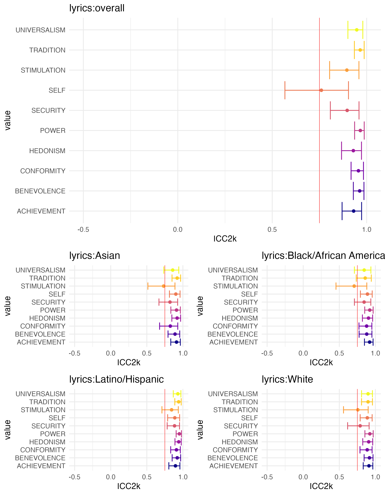

This is not the case for our two pilots which used political speech data. Overall, agreement on the speech data was unusably poor, however it appeared to improve when estimated separately for each ethnicity, with most values showing ICC2k scores over the threshold. Note that estimation for `HEDONISM` is generally poor in subsamples, and that `STIMULATION` is poor in some subsamples.

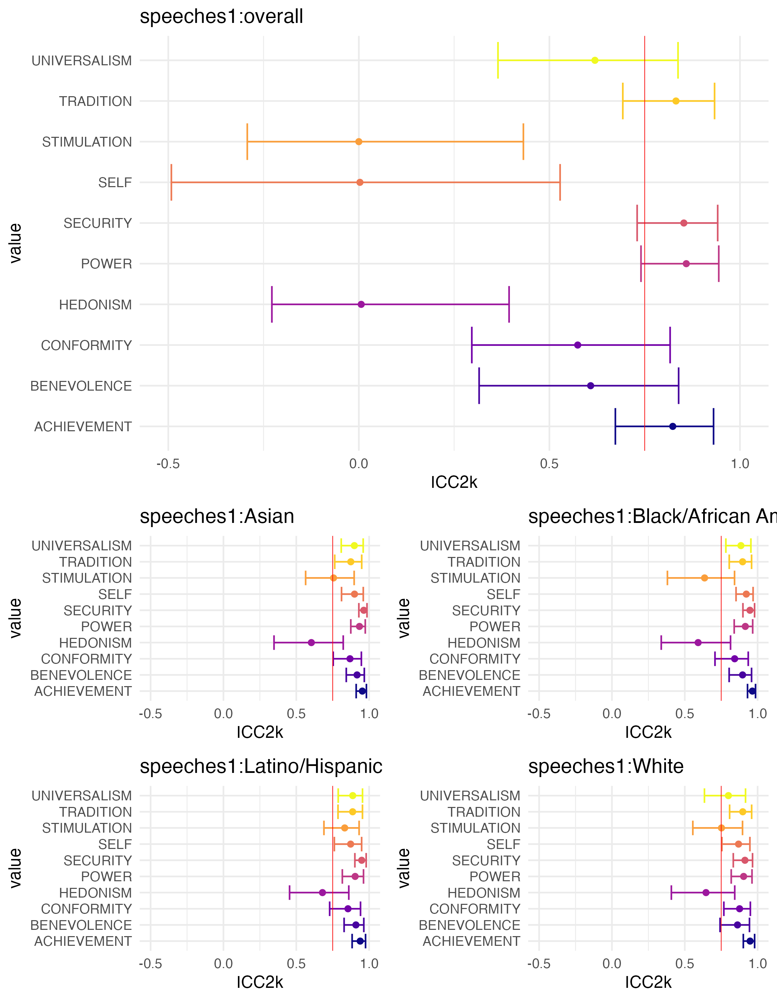

We observe similar results for our second speeches pilot, which show substantially higher ICC2k scores when they are estimated separately for each political spectrum category.

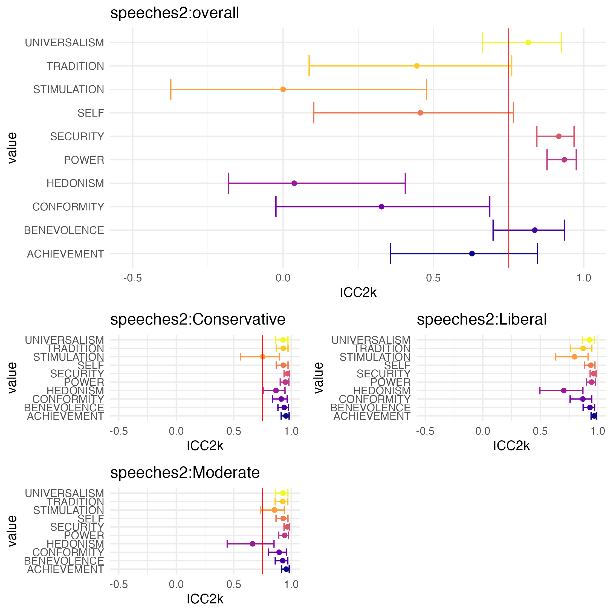

##### Conclusion

We tentatively conclude that Ethnicity will have a substantially smaller effect on ratings of song lyrics than either Ethnicity or Political Spectrum will have on ratings of speeches. Thus, the sample for our main study data collection will be stratified by Ethnicity, and for political speeches, it will also be stratified by political affiliation.

#### Estimating the number of raters

The results from our bootstrapping procedure show adequate ICC2k scores with 15 ratings for lyrics, in both ICC2k scores, and correlations between subsample means and the overall mean.

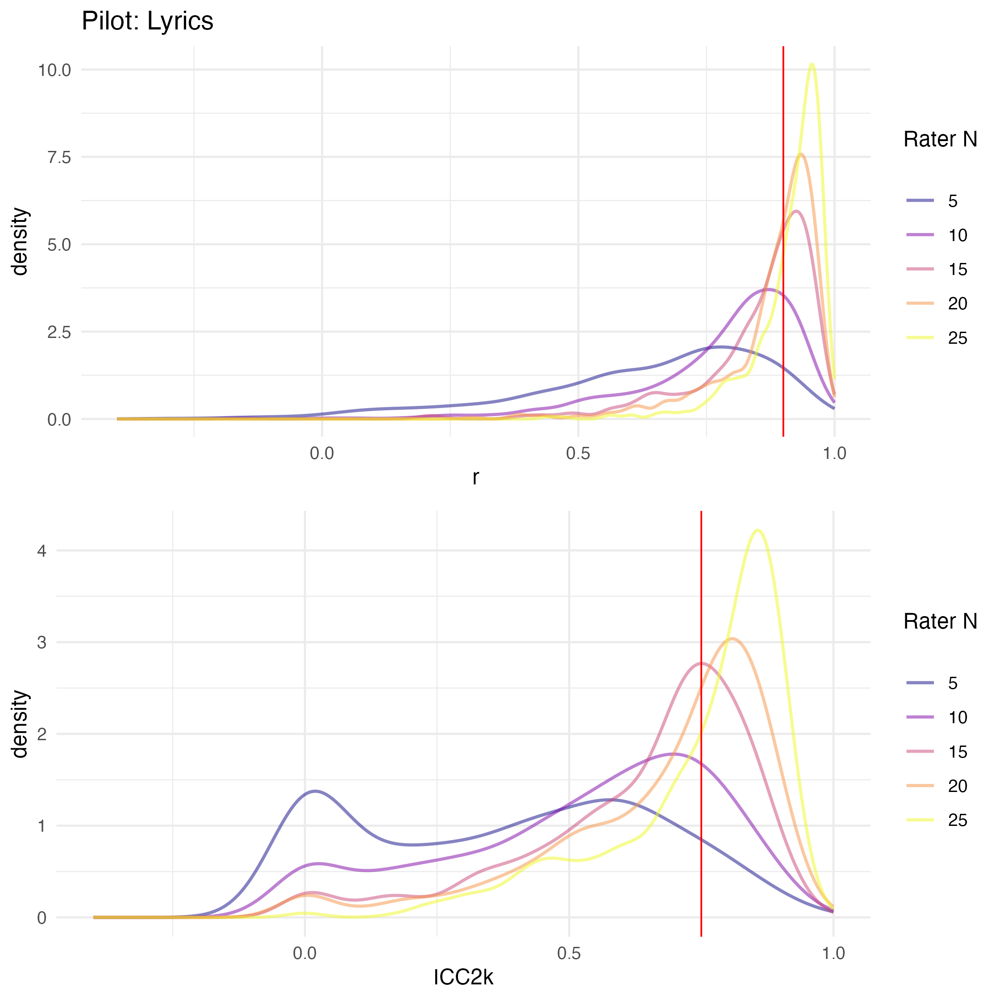

For both samples in our speech pilots, we observe a bimodal distribution in ICC2k scores, with peaks nearing our threshold, but also around 0.

Our sample of annotators in our first speeches pilot were stratified by Ethncitiy. Our bootstrapping analysis shows sufficiently high correlations between subsample means and the overall mean at around 40 ratings, however, ICC2k scores do not reach sufficiently high ICC2k scores even with 50 ratings.

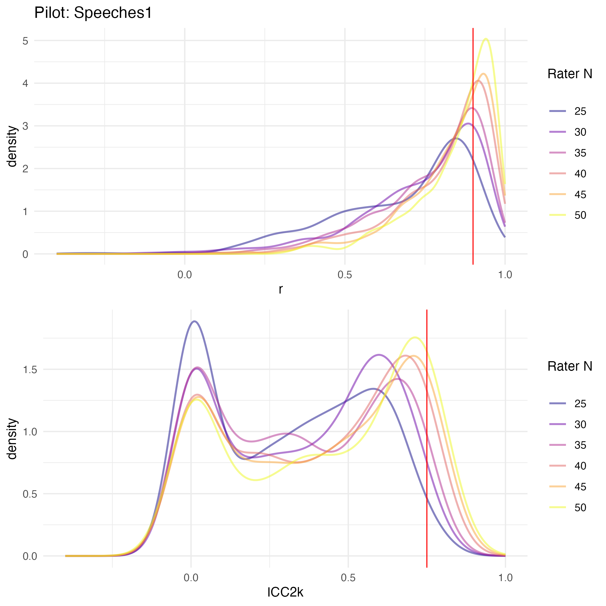

Our sample of annotators in our first speeches pilot were stratified by political affiliation. We observe a similar pattern, where the correlations between subsample means and the overall mean reach our threshold 35 ratings, but ICC2k scores are not sufficiently high even with 50 ratings.

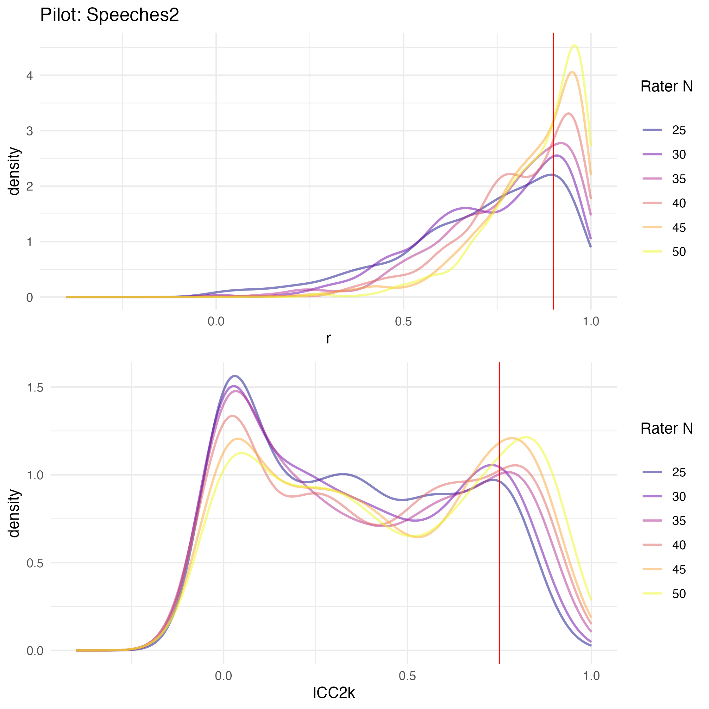

##### Conclusion

We thus proceed with a target median 15 ratings per song lyric excerpt. Based on bootstrapped correlations between subsamples and the overall sample, as well as budgetary constraints, we aim for median 40 ratings per political speech excerpt.

### Main Study

#### Initial Validation

We take a first look at the SSVS by examining multidimensional scaling plots from participant self-ratings, and compare these to the canonical Schwartz circumplex illustration:

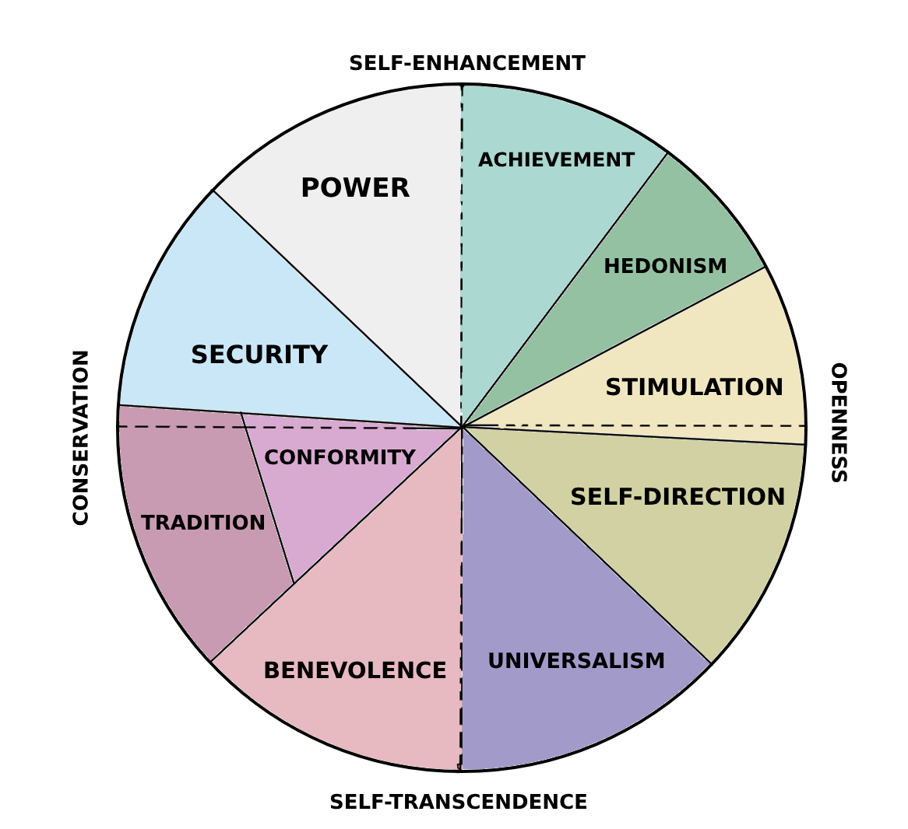

As an initial measure of validity, we examine multi-dimensional scaling plots (MDS) \cite{saeed2018survey}, which has previously been used as method to assess measurements conform to theory\~\cite{ponizovskiy2020development, lindeman2005measuring}. We compute correlations from our sample of annotations, and, from data simulated from the upper triangle of a correlation matrix reported in\~\cite{schwartz2001extending}. To compute the correlations from our sample, we averaged participant ratings per value, per song. To interpret the plots we observe whether there is a similar structure to that in Figure\~\ref{fig:circle}, and whether each value appears next to its appropriate neighbors (note: absolute position is unimportant). MDS plots (Figure\~\ref{fig:mds_plots}), show promising results, although `ACHIEVEMENT' appears closer to`SECURITY', and `HEDONISM' and`STIMULATION' are transposed.

We further compare to an MDS plot from the correlation matrix reported in a landmark study. In general, the aim of the test is to observe whether values appear next to the appropriate neighbor; note that absolute position is not relevant.

Although not identical, and not quite as circular as expected, we do observe most of the expected patterns. As we also see in the landmark study, not every point aligns with the canonical illustration.

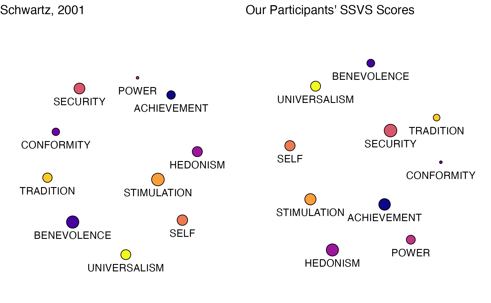

#### Inter-rater reliability

In contrast to our pilot study, in general we observe sufficient ICC2k scores, with no visible improvement when estimated by ethnicity or political leaning.

ICC2k scores for lyrics ratings appear to be exceptionally high overall, and when estimated separately within Ethnic groups, and do not seem to improve when estimated separately for each Ethnic group.

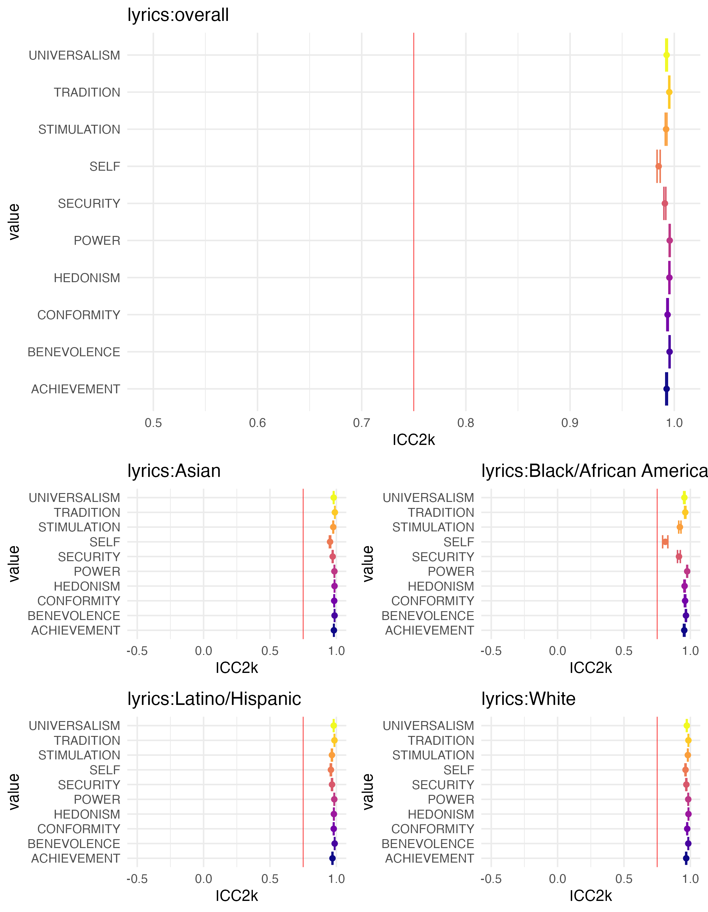

Ratings of political speeches exceed our threshold overall, though ratings do not always meet the threshold when estimated separately within Ethnic groups. In general, the estimates are visibly worse than for lyrics. Once again, we see issues with `HEDONISM` being poorly estimated for one group, and `STIMULATION` is poorly estimated for another group.

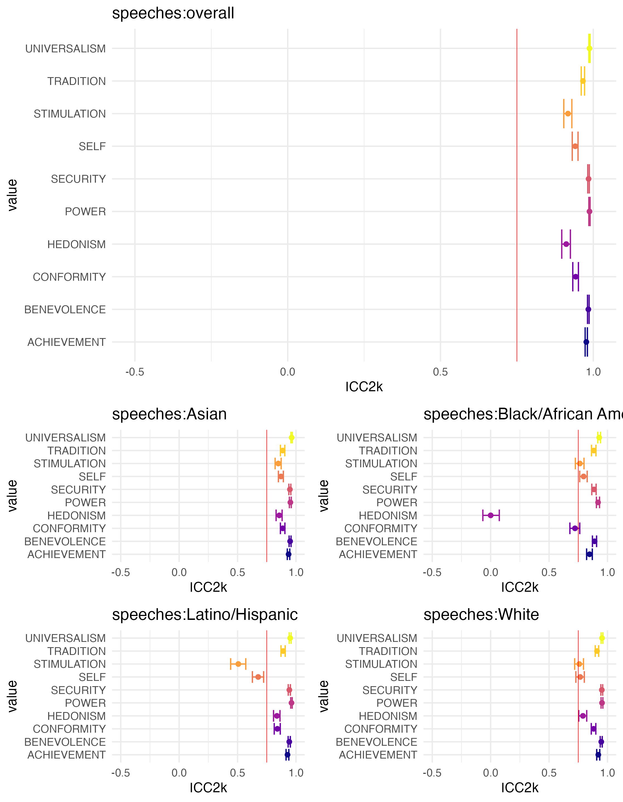

We observe a similar pattern when separating groups by political affiliation.

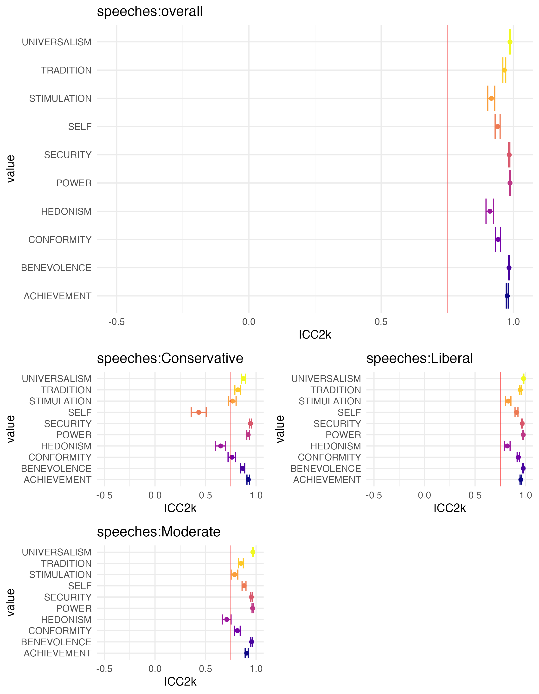

#### MDS plots of text annotations

When examining the MDS plots for our lyrics annotations, we generally see acceptable patterns with most values appearing next to appropriate neighbors, although `STIMULATION` and `HEDONISM` appear transposed, and `ACHEIVEMENT` shows a shift from the perimeter of the circumplex. These patterns are visibly worse for speeches, where we observe a strong shift for `HEDONISM` from the perimeter of the circumplex.

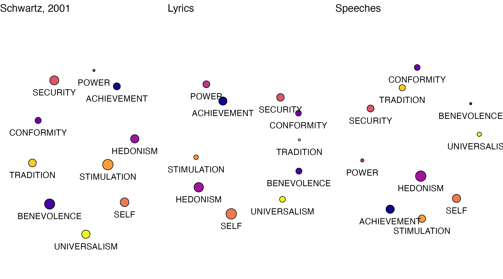

#### Model approach selection

We then determine a general modelling approach in order to estimate the effect of Ethnicity on ratings of lyrics, and Ethnicity and Political spectrum on ratings of political speeches.

To do so we plot the observed vs. predicted values and estimate a pseudo R\^2, for three models:

-   general linear mixed effects model (lmer)
-   ordinal mixed effects model (clmm)
-   generalized linear mixed effects logistic model (glmer)

Model fit was slightly worse for Lyrics:

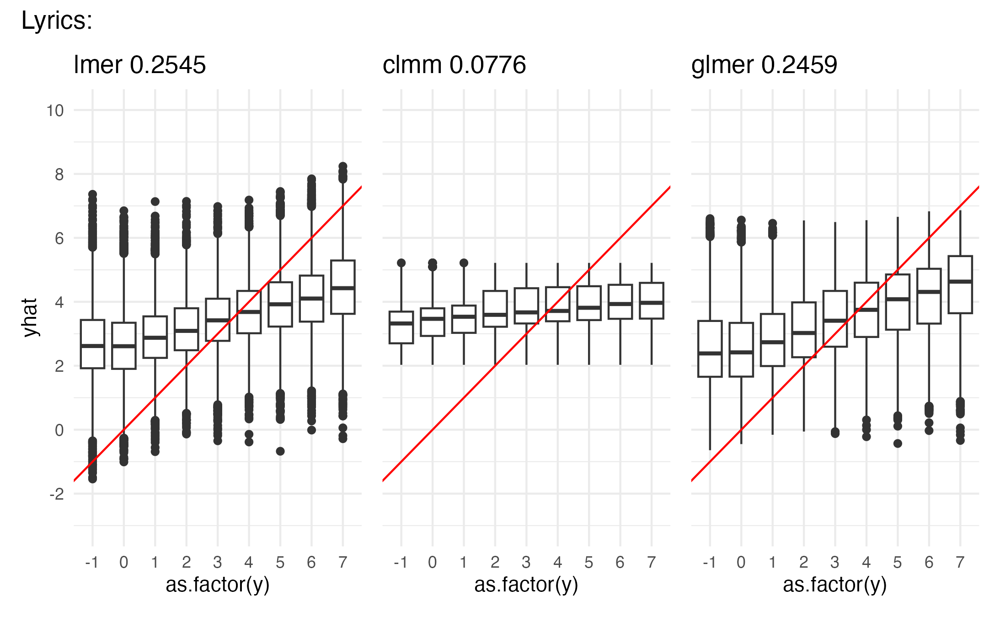

than for speeches:

or for speeches with spectrum also being estimated in place of Ethnicity:

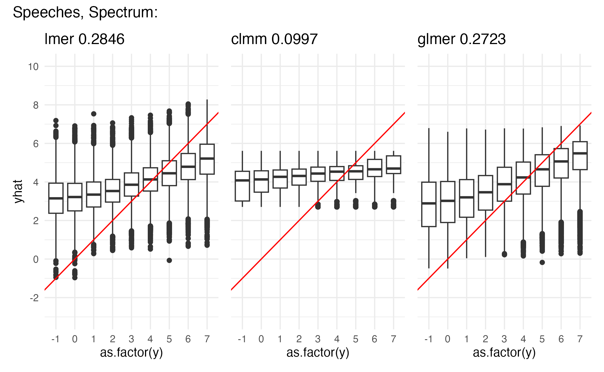

##### Conclusion

Model fit was consistently worse for ordinal mixed effects models, vs. general or generalized linear mixed effects models. We thus proceed to our specification curve analysis using general mixed effects models for ease of interpretation and computation.
